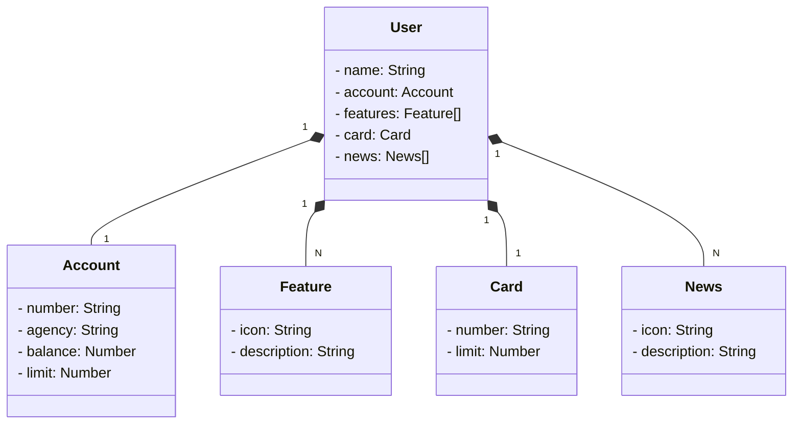

# Santander API
## Bootcamp Santander 2023

## [Figma](https://www.figma.com/file/0ZsjwjsYlYd3timxqMWlbj/SANTANDER---Projeto-Web%2FMobile?type=design&node-id=1421-432&mode=design&t=1GR2gEsQIxYgtI5Q-0)

### Class diagram

